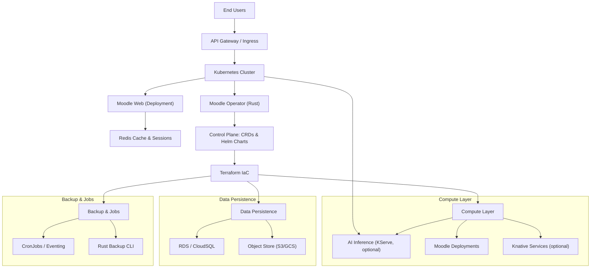
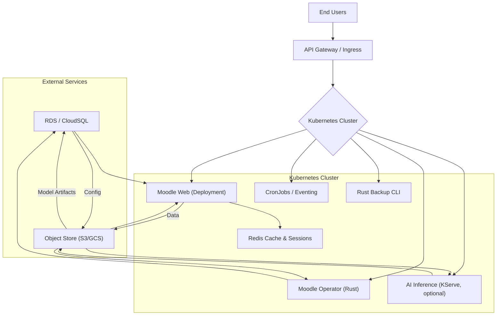

# Architecture Overview

This document provides a high-level view of the **Moodle Platform** architecture, showing how all components interact
across different deployment models.

---

## 1. Logical Components

This architecture directs incoming traffic from end users through an API Gateway into our Kubernetes cluster. Inside the
cluster, we deploy the Moodle web tier, run our Rust operator, and optionally host AI inference services, while all
persistent state (databases, object storage) and batch operations (backups, cron jobs) are managed externally or via
dedicated K8s primitives.



---

## 2. Component Descriptions

### 2.1 API Gateway / Ingress

- **Role**: Terminates TLS, routes to Knative or k8s Deployments.
- **Options**: Istio, Contour, Kourier, AWS ALB.

### 2.2 Kubernetes Cluster (with optional Knative)

- **Stateless Workloads**: Moodle web Deployments (PHP-FPM), optional Knative Services, Rust micro‑services.
- **Stateful or Control Workloads**: Rust operator Deployment, CronJobs, KServe inference pods.
- **Networking**: One IngressController (Nginx, Istio, Traefik) exposed by the API Gateway.

### 2.3 Moodle Web Tier Moodle Web Tier

- **PHP-FPM** behind Nginx (or Apache): serves web UI.
- **ObjectFS Plugin**: abstracts filesystem to S3/GCS.

### 2.4 Rust Operator

- **Custom Resource Definitions (CRDs)**: `MoodleCluster`, `MoodleBackup`, `MoodleScalePolicy`.
- **Responsibilities**:
    - Provision & reconcile Knative Services or k8s Deployments.
    - Manage Helm releases via the Go-Helm SDK (FFI layer in Rust).
    - Watch DB credentials in AWS SM / Vault and rotate if needed.

### 2.5 Terraform & Infrastructure

- **Terraform Modules**: reusable modules for VPC, Kubernetes clusters, managed DB replicas, and object stores;
  see [docs/setup/terraform.md](setup/terraform.md) for detailed module layout and usage.
- **Module Structure Example**:

  ```plaintext
  infra/terraform/
  ├── modules/
  │   ├── vpc/
  │   ├── k8s-cluster/
  │   └── db-replica/
  ├── environments/
  │   ├── staging/
  │   └── production/
  └── backend.tf
  ```

- **State Backend**: remote state stored in S3 (or GCS) with DynamoDB locking (or Cloud KMS encryption).

### 2.6 Data Persistence Data Persistence

- **Databases**: Managed PostgreSQL/MySQL.
- **File Storage**: S3/GCS-backed via Moodle’s ObjectFS.
- **Cache & Sessions**: External Redis or Memcached cluster.

### 2.7 Backup & Jobs

- **Rust Backup CLI**: schedules and performs snap‑style backups of DB and object store.
- **CronJobs / Knative Eventing**: orchestrates periodic tasks.

### 2.8 AI Inference (KServe)

- **Role**: Hosts machine learning models for features like adaptive learning suggestions, content tagging, and
  personalized recommendations.
- **Integration**: Deployed as a KServe `InferenceService` CRD on the Kubernetes cluster alongside Moodle services.
- **Workload Types**:
    - **CPU inference** for lightweight models (e.g., logistic regression, decision trees).
    - **GPU inference** for deep learning models (e.g., BERT, CNNs) via GPU-enabled nodes.

- **Model Versioning & Rollouts**:
    1. Store model artifacts in object storage (S3/GCS) with semantic versioning (e.g., `model:v1.2.0`).
    2. Define KServe `CanaryRollout` policy to gradually shift traffic from the old revision to the new one.
    3. Monitor inference metrics (latency, error rate) via Prometheus before promoting the new model.

- **Storage**: Model artifacts pulled at start-up via InitContainers; cached on local PVC for fast warm starts.
- **Autoscaling & Scaling Policies**:
    - KServe’s built-in autoscaler adjusts replica count based on request rate and GPU utilization.
    - Configure `minReplicas` and `maxReplicas` to control cost and SLA.

---

## 3. Deployment Models

> **Primary Target:** A non-serverless setup using pure Kubernetes with HPA & StatefulSets remains our recommended
> default for production workloads.

| Model                    | Description                                               | Pros                                                        | Cons                                         |
|--------------------------|-----------------------------------------------------------|-------------------------------------------------------------|----------------------------------------------|
| 🐳 Pure Kubernetes       | k8s Deployments + HPA; StatefulSets for DB & storage      | Production-ready, full control, rich ecosystem              | Operational complexity, setup overhead       |
| ☁️ Cloud-Native Managed  | EKS/GKE + RDS + ElastiCache/Memorystore + Secrets Manager | Simplified operations, auto-managed upgrades, high SLA      | Vendor lock-in, can be costlier              |
| 📦 Container-Only        | Docker Compose or ECS Fargate with external services      | Fast provisioning, low orchestration footprint              | Limited autoscaling, manual infra updates    |
| 🏗️ Bare Metal           | VMs or bare-metal servers running Docker or k3s           | Maximum performance, no virtualization overhead             | High ops burden, low elasticity              |
| 🌐 Serverless (Optional) | Knative Services for web & micro-services                 | Scale-to-zero, cost-efficient for low-traffic demos/tenants | Cold-start latency, limited stateful support |

---

## 4. Architecture Diagram

Below is a PlantUML diagram illustrating the high-level system, including client apps, external services, and key
cluster components.


